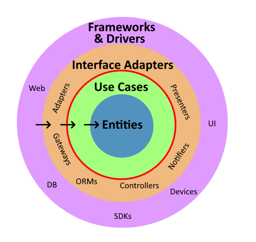

# OnionSeed (Clean Architecture Template)

## Table of Contents

- [Getting Started](#getting-started)
- [Project Structure](#project-structure)
- [Usage](#usage)
- [Contributing](#contributing)
- [License](#license)

## Overview

**OnionSeed** is a comprehensive project template that adheres to the principles exposed in the Clean Architecture book, also known as Onion Architecture. It is meticulously crafted to provide a **blueprint** for building software systems that prioritize independence from specific frameworks or technology stacks. The core philosophy behind OnionSeed is to encapsulate business rules and entities, shielding them from the intricacies of any particular framework.

The primary objective is to foster the creation of a robust, maintainable, and adaptable application architecture. OnionSeed not only sets the stage for this architectural purity but also furnishes a structured foundation that articulates high-level policies and defines clear boundaries between the different layers. This well-defined architecture facilitates the seamless development of new use cases, allowing developers to focus on low-level details within a framework-independent environment.

At the heart of OnionSeed lies the concept of framework-independent use cases. These use cases encapsulate high-level application behaviors, ensuring that they are not tightly coupled with any particular framework or technology. This decoupling empowers developers to focus on the core business logic without being burdened by framework-specific considerations.



### Getting Started

To begin your journey with **OnionSeed**, follow these initial steps:

1. **Clone the Repository:**

   ```bash
   git clone https://github.com/yourusername/onionseed.git
   cd onionseed
   ```

2. **Setup Environment:**

    - Make sure you have the necessary programming language and development tools installed.
    - Depending on your chosen language or framework, install relevant libraries or dependencies.

3. **Explore the Project:**

   Familiarize yourself with the project's structure and key components (see [Project Structure](#project-structure) below).

4. **Start Building Framework-Independent Use Cases:**

   Begin by defining your business entities and use cases in the `Core` layer.

### Project Structure

**OnionSeed** adheres to the Onion Architecture pattern and maintains the following structure:

```
project-root/
│
├── domain/
│   ├── Entities/
│   │   └── ...
│   │
│   ├── UseCases/
│   │   └── ...
│   │
│   └── ...
│
├── application/
│   ├── ...
│
├── adapters/
│   ├── ...
│
├── config/
│
└── ...
```

- **Domain**: Home to the core business entities, use cases, and application-specific rules.

- **Application**: Orchestrates interactions between the core layer and external layers.

- **Adapters**: Adapts the core application to external interfaces, such as web frameworks, databases, and more.

- **Config**: Set up the application context.

### Usage

To maximize the benefits of **OnionSeed**, adhere to these guidelines:

1. **Define Business Entities**: Create business entities within the `Domain/Entities` directory, ensuring they remain framework-agnostic and faithfully represent your core data structures.

2. **Implement Use Cases**: Develop use cases within the `Domain/UseCases` directory. These use cases should encapsulate high-level application behaviors and remain independent of specific frameworks or technologies.

3. **Adapt to Interfaces**: In the `Adapter` layer, adapt the core use cases to interface with specific technologies, such as web frameworks or databases. This layer acts as a buffer for framework-specific code.

4. **Testing**: Create unit tests for the core use cases to ensure their correct functioning. These tests in the core layer should not rely on external frameworks or dependencies.

5. **Extend and Maintain**: As your application evolves, extend the core use cases and adapt to new interfaces without disrupting the core logic.

### Contributing

We welcome contributions to improve **OnionSeed** from the open-source community. If you're interested in contributing, please fork the repository, make your changes, and submit a pull request.

### License

**OnionSeed** is open-source software and is licensed under the BSD 3-Clause License. For further details, please refer to the [LICENSE](LICENSE) file.

Thank you for choosing **OnionSeed** as the foundation for your framework-independent, clean architecture projects. If you have any questions or require assistance, do not hesitate to reach out to the project maintainers. Happy coding!